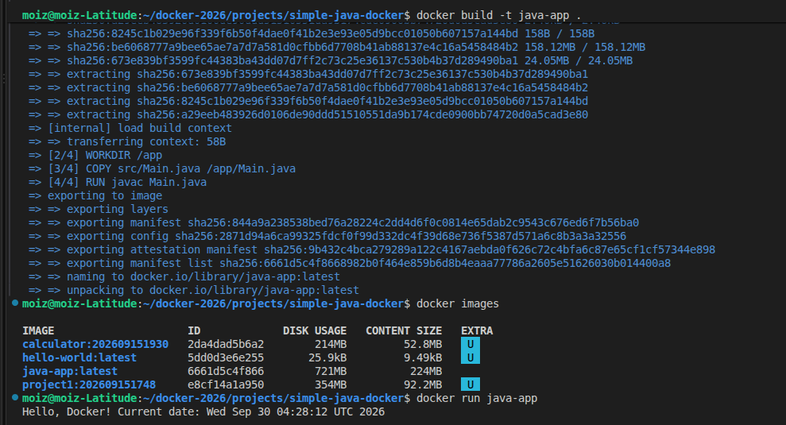

# Simple Java Docker

A minimal Java application packaged in a Docker container. This project demonstrates how to compile and run a Java class inside a lightweight container using the Eclipse Temurin JDK image.

## Overview

The application:

- Uses Java 21
- Compiles `src/Main.java` during the Docker build
- Runs the `Main` class as the container entry point
- Prints a greeting message with the current date and time

## Project structure

```text
simple-java-docker/
├── Dockerfile
├── README.md
└── src/
    ├── Main.java
    └── image/
        └── dockerfile.png
```

## Prerequisites

- Docker installed and running on your machine
- A terminal or shell

## Build the image

From the project root, run:

```bash
docker build -t simple-java-docker .
```

## Run the container

```bash
docker run --rm simple-java-docker
```

You should see output similar to:

```text
Hello, Docker! Current date: Fri Oct 02 12:34:56 UTC 2026
```

## Dockerfile summary

The Docker image uses `eclipse-temurin:21-jdk`, sets the working directory to `/app`, copies the Java source file, compiles it with `javac`, and starts the app with `java Main`.

## Example output


